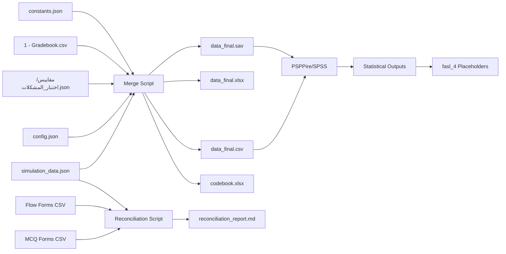

# 01 — جرد مصادر الداتا (Data Sources Audit)

> **الهدف:** توثيق كل الملفات الموجودة في البروجيكت اللي هتشارك في تجهيز داتا الإحصاء، وتحديد دور كل ملف وطريقة قراءته، وكشف المخاطر والتحديات في كل مصدر.

---

## 1. ملخص تنفيذي

- **إجمالي المصادر:** 8 ملفات (6 مصادر تحليلية + 2 أدلة إجرائية).
- **المصدر الرسمي للتحليل:** `simulation_data.json`.
- **العينة الكلية:** 96 طالب → **80 فعّال للتحليل** بعد استبعاد 16 منسحب.
- **Manipulation Check قوي متاح** من `1 - Gradebook.csv` (بيانات التأخير في التسليم).

---

## 2. جدول المصادر الكامل

| # | الملف | النوع | الحجم | الدور |
|---|---|---|---|---|
| 1 | `simulation_data.json` | JSON | ~442 KB | **المصدر الأساسي** — Pre/Post للمقياسين |
| 2 | `config.json` | JSON | ~67 KB | تعريف الأبعاد + negativeItems + Likert |
| 3 | `مقاييس نهائيه/اختبار_المشكلات_الأخلاقية_البيوطبية.json` | JSON | ~37 KB | تصنيف 30 سؤال على 4 مهارات + answer key |
| 4 | `مقاييس نهائيه/مقياس_التدفق_الذهني.json` | JSON | ~16 KB | تفاصيل المقياس (مرجعي) |
| 5 | `1 - Gradebook.csv` | CSV | ~19 KB | بيانات المهام + المنسحبين + الفرق + التأخيرات |
| 6 | `constants.json` | JSON | <1 KB | قائمة IDs المنسحبين |
| 7 | `submit_from_json.js` | JavaScript | ~43 KB | (Pipeline للتوصيل — مرجعي، ليس مصدر بيانات) |
| 8a | `اختبار حل المشكلات الأخلاقية البيوطبية (Responses) - Form Responses 1.csv` | CSV | ~602 KB | **دليل إجرائي** — 176 استجابة MCQ من Google Forms |
| 8b | `مقياس التدفق النفسي (Responses) - Form Responses 1.csv` | CSV | ~147 KB | **دليل إجرائي** — 175 استجابة Flow من Google Forms |

---

## 3. تفاصيل كل مصدر

### 3.1 `simulation_data.json` — المصدر الأساسي

**المسار:** [`../../simulation_data.json`](../../simulation_data.json)

**البنية:**
```json
{
  "metadata": {
    "generatedAt": "2026-02-21T13:31:19",
    "seed": 36890,
    "numStudents": 96,
    "numMCQ": 30,
    "numFlowItems": 56,
    "stats": {...}
  },
  "students": [
    {
      "id": "STD-001",
      "name": "نورهان أحمد",
      "email": "nourhan.ahmed84@gmail.com",
      "group": "G1",
      "mcq_pre_score": 9,
      "mcq_post_score": 14,
      "mcq_pre_responses": [3, 0, 3, ...],    // 30 integer (0-3 choice index)
      "mcq_post_responses": [0, 3, 2, ...],
      "mcq_pre_correct": [0, 0, 0, ...],       // 30 binary (0/1)
      "mcq_post_correct": [1, 0, 0, ...],
      "flow_pre_score": 149,
      "flow_post_score": 173,
      "flow_pre_responses": ["غالباً", "أحياناً", ...],  // 56 Arabic Likert
      "flow_post_responses": [...],
      "preSkill": 0.10,
      "postSkill": 0.31,
      "preFlowLevel": 0.42,
      "postFlowLevel": 0.56
    },
    ...
  ]
}
```

**نقاط القوة:**
- نظيف ومنظم.
- `mcq_*_correct` موجود جاهز (0/1) — مش محتاج نرجع لـ answer key.
- `flow_*_responses` موجودة كنصوص ليكرت — محتاجة mapping + reverse coding.
- فيه مجاميع جاهزة (`mcq_*_score`, `flow_*_score`) بس هنعيد حسابها بعد reverse coding للتحقق.

**طريقة القراءة:**
```python
import json
with open("simulation_data.json") as f:
    data = json.load(f)
students = data["students"]  # 96 students
```

---

### 3.2 `config.json` — تعريف الأبعاد و reverse coding

**المسار:** [`../../config.json`](../../config.json)

**الأقسام المهمة:**
- `flow.dimensions` — 8 أبعاد × 7 فقرات لكل بُعد (معرفات الفقرات 1-56):

  | ID | اسم البعد | الفقرات |
  |---|---|---|
  | D1 | وضوح وتحديد الأهداف | 1–7 |
  | D2 | مستوى النشاط والانشغال والتركيز والانتباه | 8–14 |
  | D3 | الشعور بالكفاءة والتحكم في الأداء | 15–21 |
  | D4 | التركيز الإدراكي ومعرفة الآثار الناتجة | 22–28 |
  | D5 | الشعور بالثقة في الأداء | 29–35 |
  | D6 | فقدان الوعي بالذات | 36–42 |
  | D7 | الشعور باستغراق الزمن | 43–49 |
  | D8 | الشعور باللذة والرضا والاستمتاع | 50–56 |

- `flow.negativeItems` — 23 فقرة عبارات سلبية (reverse coding):
  ```
  [2, 4, 6, 9, 11, 13, 16, 18, 20, 23, 25, 27, 30, 32, 34, 37, 39, 41, 46, 48, 51, 53, 55]
  ```
- `flow.choices` — `["دائماً", "غالباً", "أحياناً", "نادراً", "أبداً"]` (ترتيب Google Forms من الأعلى للأقل).
- `flow.items` — قائمة نصوص الفقرات الـ 56 بالترتيب.

**استخدامه:**
- قاموس تحويل Likert → أرقام.
- معرفة أي فقرة في أي بُعد.
- معرفة أي فقرة محتاجة reverse coding.

---

### 3.3 `مقاييس نهائيه/اختبار_المشكلات_الأخلاقية_البيوطبية.json`

**الأقسام المهمة:**
- `testInfo` — معلومات الاختبار (30 سؤال، 4 خيارات/سؤال).
- `skillsBreakdown` — تصنيف الأسئلة على 4 مهارات:
  - `تحديد المشكلة`
  - `افتراض الأسباب`
  - `اختبار الفروض`
  - `الوصول للحلول`
- `questions` — قائمة الـ 30 سؤال مع:
  - `text` (نص السؤال)
  - `choices` (4 خيارات)
  - `correctAnswer` (index الإجابة الصحيحة 0-3)
  - `skill` (أي مهارة من الأربعة)

**الاستخدام الأساسي:**
- ربط كل سؤال بمهارته لحساب `PS_*_Skill1..4`.
- (ثانوي) مطابقة إجابات Google Forms CSV مع answer key لو احتجنا reconciliation.

---

### 3.4 `مقاييس نهائيه/مقياس_التدفق_الذهني.json`

مرجعي فقط — نفس محتوى `config.json > flow` لكن كمستند مستقل للمقياس.

---

### 3.5 `1 - Gradebook.csv` — الجرد بوك

**المسار:** [`../../1 - Gradebook.csv`](../../1%20-%20Gradebook.csv)

**البنية (25 عمود):**

| العمود | النوع | المعنى |
|---|---|---|
| `ID` | نصي | STD-001..STD-096 |
| `Name` | نصي | اسم الطالب |
| `Group` | نصي | G1/G2/G3/G4 |
| `Team` | نصي | `عمل فردي` (G1/G2) أو `فريق 1..6` (G3/G4) |
| `M1`–`M5` | رقمي | درجة المهمة 1-5 (0-100) |
| `M1_Date`–`M5_Date` | تاريخ | تاريخ التسليم أو "لم يتم التسليم" |
| `M1_Late`–`M5_Late` | نصي | "نعم" / "لا" / "-" |
| `Bonus` | رقمي | نقاط إضافية |
| `Total` | رقمي | مجموع المهام (0-500) |
| `Max_Possible` | رقمي | 500 |
| `Percentage` | رقمي | Total/500 × 100 |
| `Grade` | نصي | A+/A/B+/B/C+/C/D+/D/F |
| `Is_Dropout` | نصي | "نعم" / "لا" |

**الاستخدامات:**
1. **فلتر المنسحبين** عبر `Is_Dropout = نعم`.
2. **متغير `Team`** للمجموعات التشاركية (لـ ICC check).
3. **Manipulation Check 1** — عدد التأخيرات (`Late_Count`) كدليل على تأثير الزمن.
4. **Manipulation Check 2** — إجمالي درجات المهام (`Task_Total`) كدليل على engagement.

**تحقق سريع من الداتا (تم):**
```
Total rows: 96
Dropouts: 16 (4 per group)
Effective: 80 (20 per group)
Late submissions by group:
  G1 (تنافسي×مفتوح): 0
  G2 (تنافسي×محدد): 38
  G3 (تشاركي×مفتوح): 0
  G4 (تشاركي×محدد): 23
```
→ **تأكيد قوي إن الـ Timing manipulation اشتغلت فعلاً** قبل أي تحليل إحصائي.

---

### 3.6 `constants.json` — قائمة المنسحبين

**المحتوى:**
```json
{
  "dropoutIds": [
    "STD-081", "STD-082", "STD-083", "STD-084",
    "STD-085", "STD-086", "STD-087", "STD-088",
    "STD-089", "STD-090", "STD-091", "STD-092",
    "STD-093", "STD-094", "STD-095", "STD-096"
  ]
}
```

**الاستخدام:** فلتر إضافي للتأكد من تطابق المنسحبين بين الجرد بوك و constants.json (لازم 100%).

---

### 3.7 `submit_from_json.js` — Pipeline للتوصيل (مرجعي)

**المسار:** [`../../submit_from_json.js`](../../submit_from_json.js)

**الدور:** Apps Script بياخد `simulation_data.json` وبيرسل إجاباته لـ Google Forms (MCQ + Flow) كأنها من طلاب حقيقيين، بجدول زمني واقعي.

**التفاصيل المهمة لنا:**
- السطر 541: `if (excludeDropouts && DROPOUT_IDS.indexOf(s.id) !== -1) continue;` — تأكيد إن pipeline نفسه بيستثني المنسحبين في البعدي.
- الجدولة: ساعة بداية 9، ساعة نهاية 22، فجوة ساعتين بين MCQ و Flow لنفس الطالب.
- `maxRetries: 3` — يعني ممكن نلاقي duplicates في Forms CSVs.

**ليس مصدر بيانات** — بس مرجع لفهم كيف اتنقلت الداتا من JSON للفورمات.

---

### 3.8 ملفات Google Forms Responses — أدلة إجرائية

#### 3.8a MCQ Responses

**المسار:** [`../../اختبار حل المشكلات الأخلاقية البيوطبية (Responses) - Form Responses 1.csv`](../../اختبار%20حل%20المشكلات%20الأخلاقية%20البيوطبية%20(Responses)%20-%20Form%20Responses%201.csv)

**البنية (33 عمود):**
- `Timestamp` — وقت الإرسال.
- `Score` — جاهز بصيغة `"17 / 30"` (من Google Forms auto-grading).
- `البريد الإلكتروني` — المعرّف الوحيد للطالب.
- 30 عمود = نص السؤال، والقيمة = نص الخيار المختار.

**إحصائيات:**
- عدد الصفوف: **176**
- الحسبة المتوقعة: 80 نشط × 2 (قبلي+بعدي) + 16 منسحب × 1 (قبلي فقط) = **176** ✅

#### 3.8b Flow Responses

**المسار:** [`../../مقياس التدفق النفسي (Responses) - Form Responses 1.csv`](../../مقياس%20التدفق%20النفسي%20(Responses)%20-%20Form%20Responses%201.csv)

**البنية (58 عمود):**
- `Timestamp`
- `البريد الإلكتروني`
- 56 عمود = نص الفقرة، والقيمة = ليكرت نصي (دائماً، غالباً، أحياناً، نادراً، أبداً).

**إحصائيات:**
- عدد الصفوف: **175** (استجابة واحدة ناقصة مقابل 176 المتوقعة)
- سيُرصد المفقود في مرحلة Reconciliation.

#### تحديات ملفات Forms Responses:
1. المعرّف = **إيميل** وليس `ID` → محتاج mapping عبر `simulation_data.students[].email`.
2. **مفيش عمود Pre/Post** → تمييز عبر `Timestamp` (نافذتين زمنيتين).
3. **الإجابات MCQ نصية** → match مع answer key للحصول على 0/1 لكل فقرة.
4. **Duplicates محتملة** (`maxRetries: 3`) → dedup على `(email, phase)`.

**الدور في الخطة:** فقط **Reconciliation Sanity Check** — التأكد من مطابقة 100% مع simulation_data.json. مش مصدر تحليلي.

---

## 4. ملفات مشكوك فيها / مستبعدة

| الملف | الحجم | السبب |
|---|---|---|
| `_docx_snippet2.csv` | 616 KB | نسخة مكررة من ملف MCQ Forms (نفس الحجم بالضبط) — يُتجاهَل |
| `tasks_gradebook_copy.xlsx` | 20 KB | نسخة مكررة من `tasks_gradebook.xlsx` — يُتجاهَل |
| `tadafok.json` | 19 KB | استمارة تحكيم المقياس — مرجعي للفصل الثالث، مش للإحصاء |
| `test_config.json` | 38 KB | إعدادات اختبار — مرجعي |

---

## 5. خريطة تدفق الداتا (Data Flow)



---

## 6. التحقق من جودة المصادر (Pre-flight Checks)

قبل بدء Pipeline، لازم نتأكد من:

- [ ] `simulation_data.json` موجود ويفتح بنجاح + `students.length == 96`.
- [ ] `config.json > flow.dimensions.length == 8` + كل بُعد فيه 7 فقرات.
- [ ] `config.json > flow.negativeItems.length == 23`.
- [ ] `1 - Gradebook.csv` فيه 96 صف + 16 بـ `Is_Dropout=نعم`.
- [ ] `constants.json > dropoutIds.length == 16` + مطابقة 100% مع الجرد بوك.
- [ ] أعداد Forms CSVs: 176 MCQ، 175 Flow (أو 176 لو الاستجابة الناقصة موجودة في نسخة أحدث).
- [ ] كل الـ 80 طالب النشط عندهم 4 استجابات (MCQ Pre + MCQ Post + Flow Pre + Flow Post).

---

## 7. الخطوة التالية

→ [02 — قاموس المتغيرات](02_variables_codebook.md)
