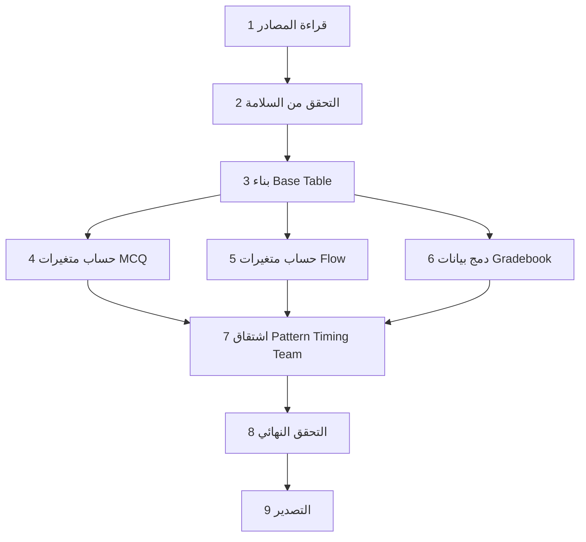

# 03 — خطوات تجهيز الداتا (Data Preparation Pipeline)

> **الهدف:** تعريف Pipeline واضح لتجهيز الداتا النظيفة اللي هتدخل SPSS/PSPP، من قراءة المصادر الخام لحد تصدير الملف النهائي. السب بلان ده يحدد كل خطوة منطقية بدون كتابة كود فعلي (الكود هيتكتب في مرحلة التنفيذ).

---

## 1. المدخلات والمخرجات

### المدخلات (من فولدر المشروع الجذر):
1. `../simulation_data.json`
2. `../config.json`
3. `../مقاييس نهائيه/اختبار_المشكلات_الأخلاقية_البيوطبية.json`
4. `../1 - Gradebook.csv`
5. `../constants.json`

### المخرجات (في `e7sa_4/outputs/`):
1. `data_final.csv` — الداتا الأساسية (UTF-8 with BOM للدعم العربي في Excel).
2. `data_final.xlsx` — نفس الداتا بصيغة Excel.
3. `data_final.sav` — ملف SPSS/PSPP جاهز.
4. `codebook.xlsx` — قاموس المتغيرات.
5. `data_log.txt` — سجل خطوات المعالجة.

---

## 2. Pipeline الكامل (9 خطوات)



---

## 3. الخطوات التفصيلية

### الخطوة 1 — قراءة المصادر

```python
# Pseudocode
sim = read_json("simulation_data.json")           # dict مع students, metadata
cfg = read_json("config.json")                    # dict مع flow, questions
mcq_instrument = read_json("مقاييس نهائيه/اختبار_المشكلات_الأخلاقية_البيوطبية.json")
gradebook = read_csv("1 - Gradebook.csv")         # DataFrame 96 rows × 25 cols
dropouts = read_json("constants.json")["dropoutIds"]  # list of 16 IDs
```

---

### الخطوة 2 — التحقق من السلامة (Integrity Checks)

قبل أي معالجة:

- [ ] `len(sim.students) == 96`
- [ ] `len(gradebook) == 96`
- [ ] `len(dropouts) == 16`
- [ ] كل ID في simulation موجود في gradebook والعكس.
- [ ] كل ID في `dropouts` موجود في gradebook بـ `Is_Dropout=نعم`.
- [ ] `cfg.flow.dimensions` فيه 8 أبعاد × 7 فقرات = 56 فقرة.
- [ ] `len(cfg.flow.negativeItems) == 23`.
- [ ] كل طالب عنده `mcq_pre_responses/post_responses` length=30 و `flow_pre/post_responses` length=56.

لو أي check فشل → abort + error message واضح.

---

### الخطوة 3 — بناء Base Table

إنشاء DataFrame واحد كل صف = طالب واحد، بالأعمدة التعريفية:

| العمود | المصدر |
|---|---|
| `ID` | `sim.students[i].id` |
| `Name` | `sim.students[i].name` |
| `Email` | `sim.students[i].email` |
| `Group` | `1 if g=='G1' else 2 if g=='G2' else 3 if g=='G3' else 4` |
| `Is_Dropout` | `1 if id in dropouts else 0` |

النتيجة: **96 صف × 5 أعمدة**.

---

### الخطوة 4 — حساب متغيرات MCQ

لكل طالب:

#### 4.1 المجاميع الكلية
- `PS_Pre_Total = sum(mcq_pre_correct)` → 0-30
- `PS_Post_Total = sum(mcq_post_correct)` → 0-30

#### 4.2 المهارات الفرعية
من `mcq_instrument.questions`، لكل سؤال معرفة `skill`:
- `PS_Pre_Skill1 = sum(mcq_pre_correct[i] for i in questions where skill=='تحديد المشكلة')`
- نفس الشيء لـ Skill2, Skill3, Skill4 وللبعدي.

#### 4.3 الفقرات الفردية
- `PS_Pre_Q01..Q30 = mcq_pre_correct[0..29]`
- `PS_Post_Q01..Q30 = mcq_post_correct[0..29]`

**التحقق:** `PS_Pre_Total == PS_Pre_Skill1+Skill2+Skill3+Skill4` (Sanity check).

---

### الخطوة 5 — حساب متغيرات Flow (مع Reverse Coding)

#### 5.1 قاموس تحويل Likert (من `cfg.flow.choices`)

```
"أبداً"   → 1
"نادراً"  → 2
"أحياناً" → 3
"غالباً"  → 4
"دائماً"  → 5
```

> **ملاحظة مهمة:** في `cfg.flow.choices` الترتيب هو `["دائماً", "غالباً", "أحياناً", "نادراً", "أبداً"]` (ترتيب Google Forms من أعلى لأقل تكراراً). أثناء Likert mapping، نخلي `"أبداً"=1 ... "دائماً"=5` بغض النظر عن ترتيب العرض.

#### 5.2 خطوات المعالجة لكل فقرة i (1-56)

```
raw_value  = map_likert(flow_pre_responses[i-1])  # 1-5
if i in cfg.flow.negativeItems:
    corrected = 6 - raw_value                      # reverse coding
else:
    corrected = raw_value
Flow_Pre_I<i> = corrected
```

تكرار نفس الشيء للـ `flow_post_responses`.

#### 5.3 حساب الأبعاد (بعد العكس)

لكل بُعد k (1-8) من `cfg.flow.dimensions[k-1].items`:
```
Flow_Pre_Dk  = sum(Flow_Pre_I<i>  for i in items)   # 7-35
Flow_Post_Dk = sum(Flow_Post_I<i> for i in items)
```

#### 5.4 حساب الدرجة الكلية
```
Flow_Pre_Total  = sum(Flow_Pre_D1..D8)   # 56-280
Flow_Post_Total = sum(Flow_Post_D1..D8)
```

**التحقق:** `Flow_Pre_Total == sum(Flow_Pre_I01..I56)` (sanity check).

#### 5.5 تحذير عن العلامة الكسرية في `mcq_*_score` و `flow_*_score` الموجودة في JSON

الدرجات الموجودة في `sim.students[i].mcq_pre_score` و `flow_pre_score` قد تختلف قليلاً عن اللي هنحسبه (خاصة Flow بسبب reverse coding). هنعتمد **حسبتنا الجديدة** كمصدر الحقيقة، بس نسجل الفرق في `data_log.txt` للتحقق.

---

### الخطوة 6 — دمج بيانات الجرد بوك

من `gradebook` DataFrame، نضم على `ID`:

| العمود في Gradebook | المتغير في Base Table | التحويل |
|---|---|---|
| `M1`..`M5` | `Task_M1`..`Task_M5` | direct (نحول النصوص "0" لـ 0) |
| `M1_Late`..`M5_Late` | `Late_M1`..`Late_M5` | `نعم→1, لا→0, -→missing` |
| `Bonus` | `Task_Bonus` | direct |
| `Total` | `Task_Total` | direct |
| `Percentage` | `Task_Percentage` | direct |
| `Grade` | `Task_Grade` | direct |
| `Team` | `Team` (بعد التحويل) | `عمل فردي→0, فريق X→X` |

**المشتقات:**
- `Late_Count = sum(Late_M1..Late_M5)` (مع معالجة missing: للمنسحبين قد يكون "-" في 3 مهام).

**للمنسحبين:** درجات المهام من 3-5 تكون 0 (لم يتم التسليم) و`Late_Mx="-"` → تحول لـ missing. `Late_Count` يحسب فقط الـ"نعم" وبالتالي للمنسحب الذي لم يسلم = 0 (ليس متأخر، بل غائب). هذا مقبول لأن المنسحبين سيُستبعدون من التحليل.

---

### الخطوة 7 — اشتقاق Pattern, Timing, Team

من `Group`:

| Group | Pattern | Timing |
|---|---|---|
| 1 (G1) | 1 (تنافسي) | 2 (مفتوح) |
| 2 (G2) | 1 (تنافسي) | 1 (محدد) |
| 3 (G3) | 2 (تشاركي) | 2 (مفتوح) |
| 4 (G4) | 2 (تشاركي) | 1 (محدد) |

كود مختصر:
```
Pattern = 1 if Group in [1,2] else 2
Timing  = 1 if Group in [2,4] else 2    # محدد
```

---

### الخطوة 8 — التحقق النهائي (Post-build Validation)

- [ ] 96 صف في الداتا النهائية.
- [ ] 16 صف بـ `Is_Dropout=1`.
- [ ] توزيع `Group`: 24 طالب/مجموعة.
- [ ] توزيع `Group` بعد فلترة `Is_Dropout=0`: 20/مجموعة.
- [ ] كل الأعمدة الرقمية بدون قيم شاذة خارج المدى (مثلاً `Flow_Post_Total > 280` لا يُقبل).
- [ ] مجموع الفقرات يساوي مجموع الأبعاد يساوي الدرجة الكلية (لكل قياس ولكل طالب).
- [ ] `Pattern` و `Timing` متسقين مع `Group`.
- [ ] عدد الأعمدة = 223 (أو القيمة المتوقعة بحسب codebook).

إذا اجتاز كل الاختبارات → كتابة ✅ في `data_log.txt`، وإلا تفاصيل الفشل.

---

### الخطوة 9 — التصدير

#### 9.1 CSV
- encoding: `utf-8-sig` (علشان Excel يعرض العربي صح).
- separator: `,`
- line terminator: `\n`

#### 9.2 XLSX
- مكتبة `openpyxl` أو `pandas.to_excel`.
- sheet name: `data_final`.
- sheet ثاني اسمه `codebook` فيه قاموس المتغيرات.

#### 9.3 SAV (SPSS/PSPP)
- مكتبة `pyreadstat` (بتشتغل على Mac).
- مع كل variable labels وقيم القيم (value labels) من [02 — Codebook](02_variables_codebook.md).
- `measure` لكل متغير (Nominal/Ordinal/Scale).

```python
import pyreadstat
pyreadstat.write_sav(
    df,
    "outputs/data_final.sav",
    column_labels=labels_dict,
    variable_value_labels=value_labels_dict,
    variable_measure=measure_dict,
)
```

#### 9.4 data_log.txt
نص مختصر فيه:
- تاريخ التوليد
- عدد الصفوف والأعمدة
- نتائج Integrity Checks
- فروق بين الدرجات المحسوبة والدرجات الموجودة في JSON (لو موجودة)
- أي تنبيهات

#### 9.5 codebook.xlsx
Sheet واحد يحتوي الأعمدة: `Name, Label, Type, Width, Decimals, Values, Missing, Measure, Description`.

---

## 4. Pseudocode مختصر للـ Pipeline الكامل

```python
def run_pipeline():
    # 1. Load
    sim = load_simulation()
    cfg = load_config()
    mcq_inst = load_mcq_instrument()
    gb = load_gradebook()
    dropouts = load_dropouts()

    # 2. Integrity
    run_integrity_checks(sim, cfg, mcq_inst, gb, dropouts)

    # 3. Base
    df = build_base_table(sim, dropouts)

    # 4. MCQ
    df = compute_mcq_variables(df, sim, mcq_inst)

    # 5. Flow
    df = compute_flow_variables(df, sim, cfg)

    # 6. Gradebook merge
    df = merge_gradebook(df, gb)

    # 7. Derive
    df = derive_pattern_timing(df)

    # 8. Validate
    run_post_build_validation(df)

    # 9. Export
    export_csv(df, "outputs/data_final.csv")
    export_xlsx(df, "outputs/data_final.xlsx")
    export_sav(df, "outputs/data_final.sav")
    write_log("outputs/data_log.txt")
    write_codebook("outputs/codebook.xlsx")
```

---

## 5. المدة الزمنية المتوقعة للتنفيذ
- كتابة السكريبت: ساعة – ساعتين.
- التشغيل الفعلي: أقل من 30 ثانية.
- مراجعة المخرجات: 30 دقيقة.

---

## 6. الخطوة التالية

→ [04 — مواصفات ملفات المخرجات](04_output_files_spec.md)
