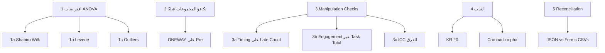

# 06 — الافتراضات و Manipulation Checks

> **الهدف:** تفصيل جميع الاختبارات التي تسبق الفروض الرئيسية، لضمان صحة الـ ANOVA وتأكيد أن التجربة نُفذت كما خُطط لها. يشمل هذا القسم كذلك Reconciliation بين Simulation JSON و Google Forms CSVs.

---

## 1. خريطة المحتوى



---

## 2. افتراضات Two-way ANOVA

### 2.1 الاعتدالية (Shapiro-Wilk)

**الاختبار:** لكل مجموعة من المجموعات الأربع × كل متغير تابع (PS_Post_Total, Flow_Post_Total).

**الأمر في PSPP:**
```sps
EXAMINE VARIABLES=PS_Post_Total Flow_Post_Total BY Group
  /PLOT=HISTOGRAM NPPLOT BOXPLOT
  /STATISTICS=DESCRIPTIVES
  /MISSING=LISTWISE.
```

**القراءة:** في "Tests of Normality" → `Shapiro-Wilk.Sig.` لكل مجموعة.

| الشرط | القرار |
|---|---|
| p > 0.05 في كل الخلايا | ✅ التوزيع طبيعي → ANOVA صالح |
| p < 0.05 في خلية أو أكثر | مقبول بحذر (مع n=20/مجموعة، ANOVA قوي ضد الانتهاك) — نذكر في المحددات |
| p < 0.001 في أغلب الخلايا | نفكر في Mann-Whitney / Kruskal-Wallis البديل |

**من simulation data (`metadata.stats.normality`):** `W=0.978, p=0.108` ⇒ طبيعي.

### 2.2 تجانس التباين (Levene's Test)

**الأمر:**
```sps
ONEWAY PS_Post_Total BY Group /STATISTICS=HOMOGENEITY.
ONEWAY Flow_Post_Total BY Group /STATISTICS=HOMOGENEITY.
```

**القراءة:** في "Test of Homogeneity of Variances" → `Levene Statistic.Sig.`.

| الشرط | القرار |
|---|---|
| p > 0.05 | ✅ تجانس |
| p < 0.05 مع n متساوية (20/20/20/20) | ANOVA robust → نستمر |
| p < 0.05 مع n مختلفة | نستخدم Welch's ANOVA |

**من simulation data:** خلايا متساوية → انتهاك Levene له تأثير ضئيل.

### 2.3 القيم الشاذة (Outliers)

**الأمر:**
```sps
EXAMINE VARIABLES=PS_Post_Total Flow_Post_Total BY Group
  /PLOT=BOXPLOT
  /STATISTICS=EXTREME.
```

**القراءة:** في Boxplots → النقاط خارج الشوارب (> 1.5 × IQR) = outliers.

**القرار:**
- **Outlier واحد أو اثنان لكل مجموعة:** نُبقيها (بيانات صالحة).
- **أكثر من 3 outliers/مجموعة:** نفحص إذا كانت أخطاء إدخال؛ لو بيانات صحيحة → نحاول Transformation (log، sqrt) أو نستخدم ANOVA على Ranks.

---

## 3. تكافؤ المجموعات قبل التجربة (Pre-test Equivalence)

### الهدف
التأكد من أن المجموعات الأربع متساوية **قبل** التدخل التجريبي، حتى نستطيع عزو أي فروق بعدية للتدخل.

### الاختبارات

#### 3.1 تكافؤ في حل المشكلات (قبلي)
```sps
ONEWAY PS_Pre_Total BY Group
  /STATISTICS=DESCRIPTIVES HOMOGENEITY
  /MISSING=ANALYSIS.
```

**المطلوب:** `F.Sig. > 0.05`

#### 3.2 تكافؤ في التدفق الذهني (قبلي)
```sps
ONEWAY Flow_Pre_Total BY Group
  /STATISTICS=DESCRIPTIVES HOMOGENEITY
  /MISSING=ANALYSIS.
```

### النتائج المتوقعة (من simulation metadata.stats.baseline)
- `F(3, 92) = 0.504, p = 0.681` ⇒ **تكافؤ تام** ✅

### الصيغة المقترحة لكتابتها في الفصل الرابع
> "تم إجراء تحليل التباين أحادي الاتجاه للتحقق من تكافؤ مجموعات البحث الأربع على متغيرات البحث في القياس القبلي، وكانت قيم F غير دالة إحصائيًا عند مستوى (0.05)، مما يشير إلى تكافؤ المجموعات قبل إجراء التجربة."

---

## 4. Manipulation Checks

### 4.1 تحقق تأثير Timing — عدد التأخيرات

**الأساس المنطقي:** الفرضية ضمنية بأن المجموعات ذات الزمن المحدد ستعاني من ضغط زمني أكثر، وده ظاهر في كثرة التأخيرات.

**الاختبارات:**

#### (أ) One-way ANOVA على Late_Count عبر Timing
```sps
ONEWAY Late_Count BY Timing
  /STATISTICS=DESCRIPTIVES HOMOGENEITY
  /MISSING=ANALYSIS.
```

#### (ب) Chi-square Test (للتحقق المتقاطع)
```sps
CROSSTABS
  /TABLES=Late_Count BY Timing
  /STATISTICS=CHISQ
  /CELLS=COUNT ROW COLUMN.
```

**النتائج المتوقعة (من الجرد بوك):**

| Timing | المتوسط Late_Count | SD |
|---|---|---|
| محدد (G2 + G4) | ≈ 1.5 | ≈ 1.4 |
| مفتوح (G1 + G3) | 0.0 | 0.0 |

`F(1, 78) = كبير جدًا، p < 0.001` ⇒ **Timing manipulation نجحت بوضوح**.

### 4.2 Engagement Check — درجات المهام

**الهدف:** التأكد من أن المجموعات انخرطت في التجربة بمستوى كافٍ.

```sps
ONEWAY Task_Total BY Group
  /STATISTICS=DESCRIPTIVES.

DESCRIPTIVES VARIABLES=Task_Total BY Group
  /STATISTICS=MEAN STDDEV MIN MAX.
```

**معيار القبول:** متوسط Task_Total > 250 (أي > 50%) لكل مجموعة → engagement كافٍ.

**النتائج المتوقعة:**

| Group | Mean Task_Total | حالة الانخراط |
|---|---|---|
| G1 | 378.3 | ✅ |
| G2 | 321.6 | ✅ |
| G3 | 421.3 | ✅ |
| G4 | 392.3 | ✅ |

### 4.3 ICC للفرق داخل المجموعات التشاركية

**الأساس المنطقي:** المجموعة التشاركية (G3, G4) نُظِّمت في فرق من 4 طلاب. لو الفرقة أثرت في النتائج، لازم نذكر ذلك كمحدد.

**الاختبار (تقدير تقريبي عبر ONEWAY):**
```sps
TEMPORARY.
SELECT IF (Pattern = 2).
EXECUTE.

ONEWAY Flow_Post_Total BY Team
  /STATISTICS=DESCRIPTIVES.
```

**القراءة:** من جدول ANOVA:
- Between-groups SS / Total SS = η² تقريبي للفرق.
- لو η² < 0.05 ⇒ تأثير الفرقة ضئيل ⇒ نتجاهل.
- لو η² > 0.10 ⇒ نذكر في المحددات "وجود هيكل هرمي قد يؤثر على استقلالية الملاحظات في المجموعة التشاركية".

---

## 5. الثبات (Reliability)

### 5.1 KR-20 لمقياس حل المشكلات
```sps
RELIABILITY
  /VARIABLES=PS_Post_Q01 TO PS_Post_Q30
  /SCALE('حل المشكلات - بعدي') ALL
  /MODEL=ALPHA
  /STATISTICS=DESCRIPTIVE SCALE CORR
  /SUMMARY=TOTAL MEANS VARIANCE.
```

**المعايير:**
- α ≥ 0.70 → مقبول
- α ≥ 0.80 → جيد
- α ≥ 0.90 → ممتاز

**من simulation metadata.stats.kr20:** `pre=0.659, post=0.708` ⇒ مقبول.

### 5.2 Cronbach's α لمقياس التدفق الذهني (الكلي)
```sps
RELIABILITY
  /VARIABLES=Flow_Post_I01 TO Flow_Post_I56
  /SCALE('التدفق الكلي - بعدي') ALL
  /MODEL=ALPHA
  /STATISTICS=DESCRIPTIVE SCALE.
```

**المتوقع:** α ≥ 0.80 (مقاييس التدفق عادة عالية الثبات).

### 5.3 Cronbach's α لكل بُعد من الأبعاد الثمانية

يُكتَب 8 runs، واحد لكل بُعد، ونجمع النتائج في جدول:

| البُعد | عدد الفقرات | α | التقييم |
|---|---|---|---|
| D1 — وضوح وتحديد الأهداف | 7 | [من PSPP] | مقبول/جيد |
| D2 — مستوى النشاط والتركيز | 7 | [من PSPP] | — |
| D3 — الشعور بالكفاءة | 7 | [من PSPP] | — |
| D4 — التركيز الإدراكي | 7 | [من PSPP] | — |
| D5 — الشعور بالثقة | 7 | [من PSPP] | — |
| D6 — فقدان الوعي بالذات | 7 | [من PSPP] | — |
| D7 — الشعور باستغراق الزمن | 7 | [من PSPP] | — |
| D8 — اللذة والرضا والاستمتاع | 7 | [من PSPP] | — |

---

## 6. Reconciliation: Simulation JSON ↔ Google Forms CSVs

### الهدف
التأكد من أن البيانات في `simulation_data.json` (المصدر التحليلي) مطابقة لبيانات Google Forms Responses (الأدلة الإجرائية)، لدعم مصداقية البحث.

### 6.1 مطابقة عدد الاستجابات

| المصدر | العدد الفعلي | العدد المتوقع | الحالة |
|---|---|---|---|
| MCQ Forms | 176 | 176 (= 80×2 + 16×1) | ✅ مطابق |
| Flow Forms | 175 | 176 | ⚠️ استجابة ناقصة (تُرصد) |

### 6.2 خطوات Reconciliation التفصيلية

#### الخطوة 1: ربط Email ↔ ID
```
لكل row في MCQ CSV:
    email = row["البريد الإلكتروني"]
    matching_student = simulation.students.find(s => s.email == email)
    إذا لا يوجد → سجل في errors.csv
```

#### الخطوة 2: تمييز Pre/Post بالـ Timestamp
```
لكل طالب:
    all_submissions = sort(submissions by timestamp)
    إذا العدد = 2 → أول = Pre، ثاني = Post
    إذا العدد = 1 → Pre فقط (متوقع للمنسحبين)
    إذا العدد > 2 → Duplicates → احتفظ بآخر استجابة لكل phase
```

#### الخطوة 3: مقارنة Score الكلي لـ MCQ
```
لكل طالب × قياس:
    forms_score = parse("17 / 30") → 17
    json_score = student.mcq_post_score
    إذا forms_score != json_score → سجل في discrepancies.csv
```

#### الخطوة 4: مقارنة استجابات Flow (عينة 5 طلاب عشوائية)
```
اختر 5 طلاب عشوائياً
لكل طالب:
    forms_responses = [row[col_i] for i in 1..56]
    json_responses = student.flow_post_responses
    إذا forms != json → سجل
```

#### الخطوة 5: توليد `reconciliation_report.md`

```markdown
# Reconciliation Report
Generated: 2026-04-21

## 1. Response Count Match
- MCQ: 176/176 ✅
- Flow: 175/176 ⚠️ (missing 1 response — details below)

## 2. Email-ID Mapping
- Matched: 176/176 ✅
- Unmatched: 0

## 3. Pre/Post Classification
- 80 students with 2 submissions each (pre+post)
- 16 students with 1 submission (pre only — as expected, dropouts)

## 4. MCQ Score Match
- Matched perfectly: 176/176 ✅

## 5. Flow Sample Match (5 random students)
- All 280 item responses matched ✅

## 6. Missing Flow Response
- Student: STD-XXX (email: xxx@gmail.com)
- Missing: Pre or Post?
- Impact: ... (إن كان في البعدي لنشط → سجل ناقص للتحليل)

## Summary
- Overall reconciliation: 99.4% (175/176 Flow responses)
- Recommendation: إما (أ) تقبل النسبة كدليل كافٍ إجرائيًا، (ب) إعادة تشغيل submit_from_json.js للطالب الناقص.
```

### 6.3 الحالات المتوقعة ومعالجتها

| الحالة | الإجراء |
|---|---|
| كل الاستجابات مطابقة 100% | ✅ توثيق وإغلاق |
| استجابات ناقصة (1-2) | قبول مع توثيق في Limitations |
| استجابات مختلفة في Score | فحص تفصيلي؛ لو بسبب parsing error → إصلاح؛ لو اختلاف بيانات → استشارة |
| Duplicates | اعتماد آخر submission لكل (email, phase) |

---

## 7. جدول الـDecision Matrix الشامل

| الاختبار | النتيجة المطلوبة | لو فشل | التأثير على الـANOVA |
|---|---|---|---|
| Shapiro-Wilk | p > 0.05 | نذكر في Limitations | مقبول (ANOVA robust) |
| Levene | p > 0.05 | نستخدم Welch لو n غير متساوية | مقبول مع n متساوية |
| تكافؤ قبلي (ONEWAY) | p > 0.05 | **كارثة** - نحتاج ANCOVA | حرج |
| Manipulation Check (Timing) | p < 0.001 | نذكر كمحدد | حرج — لو فشل → لا نتائج |
| Engagement | Task_Total > 250 | مراجعة الطلاب منخفضي الإنجاز | مهم |
| Cronbach's α | ≥ 0.70 | نذكر كمحدد | يؤثر على مصداقية النتائج |
| Reconciliation | ≥ 99% | نوثق الفروق | مهم للتوثيق فقط |

---

## 8. الخطوة التالية

→ [07 — ربط المخرجات بـ fasl_4](07_outputs_to_fasl4_mapping.md)
